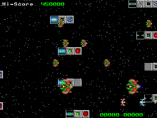
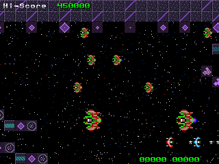
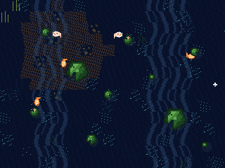

# tile_engine_retro

A 16-bit-console-style tile engine and shoot-em-up, written in C as a
[libretro](https://www.libretro.com/) core. Started in 2017 by Daniel
Jiménez and Luis Navarro; resurrected in 2026.

The engine emulates the *constraints* of classic hardware in software:
palettized 4bpp tiles, two background layers with per-scanline scroll,
two sprite layers with OAM-style attributes (flips, rotation, double
size), 50/50 semitransparency, palette-driven effects and fades — all
composed by a span-based software renderer into an ARGB1555 framebuffer.

| Asteroid Run | Crystal Cavern | Koi Pond |
|---|---|---|
|  |  |  |

Two of the scenes are a horizontal shmup; the third is a top-down zen
pond -- same engine, same four layers, used differently: sprite rotation
becomes fish headings, per-scanline offsets become water refraction,
semitransparency becomes ripples and light shafts, palette rotation
becomes caustics.

## Build and run

Requirements: a C compiler and [RetroArch](https://www.retroarch.com/).
Optional: `libxmp` for module music (auto-detected via pkg-config;
without it the core builds silent), `python3` + Pillow to regenerate the
generated scene art.

On Linux Mint / Ubuntu, `./setup_linux.sh` checks for the requirements,
shows what it wants to install, and asks before installing. On macOS use
MacPorts/Homebrew for `libxmp` and RetroArch.

```sh
./setup_linux.sh   # Linux only: install requirements (asks first)
make               # builds the core, the gfxtool pipeline and all assets
make run           # launches RetroArch with the core
make test          # unit tests + 30s headless gameplay + save-state
                   # round trip, all under AddressSanitizer
```

## Controls

- **D-pad / arrows** — move
- **A** — fire (shmup) / drop food (pond)
- **Start** — select scene / return to the scene menu
- RetroArch hotkeys give you save states (F2/F4) and rewind for free —
  the core serializes its full state deterministically.

## Layout

- `gfx_engine.h/.c` — the engine, a plain library with explicit state
  (`gfx_context`); no globals of its own
- `game2.h` — the game layer (structure-of-arrays entities, scene menu,
  scripted timelines, synthesized SFX)
- `core/` — the libretro shell (input, scenes, palette effects, audio
  mix, save states)
- `tools/gfxtool.c` — manifest-driven asset pipeline (build / dump /
  import-scene); `assets/*.mfst` describe each pack
- `test/` — unit tests and the headless harness (frame CRCs, PNG dumps)
- `Readme` — the original 2017 design document, kept current
- `TODO` — the living roadmap

## History

The initial design document is dated 18-11-2017. Development ran through
spring 2018, paused for eight years, and resumed in July 2026 — same
engine, same friends.
